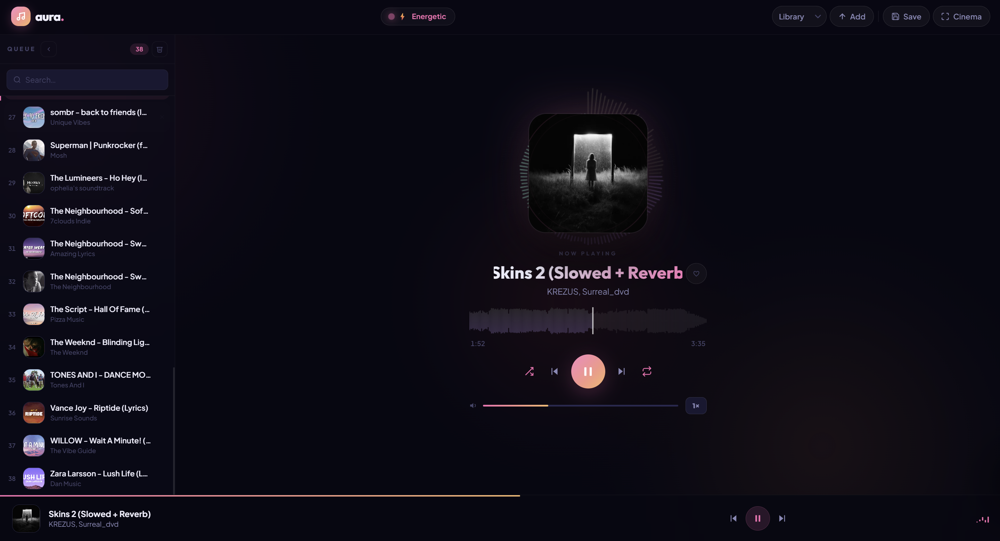

# 🎵 Aura Player

<div align="center">



**A production-grade, mood-aware music player built with React + TypeScript + Vite**

[](https://react.dev)
[](https://typescriptlang.org)
[](https://vitejs.dev)
[](LICENSE)

[Features](#-features) • [Getting Started](#-getting-started) • [Keyboard Shortcuts](#-keyboard-shortcuts) • [Architecture](#-architecture) • [Roadmap](#-roadmap)

</div>

---

## 📖 Overview

Aura Player is a fully client-side, privacy-first music player that runs entirely
in your browser. No servers, no uploads, no accounts — your music stays on your
device. It analyses audio in real-time to detect mood and adapts its entire visual
theme accordingly, creating an immersive listening experience.

---

## ✨ Features

### 🎧 Core Playback
- **Local file playback** — MP3, FLAC, WAV, OGG, M4A, AAC
- **Drag & drop** files or folders anywhere on the screen
- **Persistent library** — tracks survive page reloads via IndexedDB
- **Queue management** — reorder by drag-and-drop, remove individual tracks, clear all
- **Playback controls** — play/pause, previous, next, seek
- **Playback speed** — 0.75×, 1×, 1.25×, 1.5× cycling
- **Volume control** — click or drag the volume bar
- **Repeat & shuffle** modes with persistence
- **Resume playback** — remembers last track and position

### 🌈 Mood Engine
- **Real-time audio analysis** via Web Audio API
- **4 automatic moods** — Calm 🌊, Energetic ⚡, Melancholic 🌙, Euphoric ✨
- **Mood-driven theming** — accent colors, glows, and ambient canvas change live
- **Smoothed detection** — 10-frame history prevents flickering
- **Album-art color extraction** — extracts average color when mood is standby

### 🎨 Visual Experience
- **Ambient canvas** — animated orbs in the background that shift with mood
- **Frequency visualizer** — radial bar chart around album art
- **Waveform display** — rendered from decoded audio data, click-to-seek
- **Immersive / Cinema mode** — full-screen overlay with blurred album art backdrop
- **Vinyl ring animation** — spins while playing
- **Album art float** — subtle levitation animation while playing
- **EQ dots & bars** — animated equalizer indicators in sidebar and bottom bar

### 📱 Responsive Design
- **Desktop** — sidebar + main player with optional collapse
- **Tablet** — adaptive header, hidden mood pill, overflow menu
- **Mobile** — slide-in drawer sidebar, single-column layout, touch-optimised
- **All screen sizes** — tested down to 320px wide

### 🗂️ Library & Playlists
- **Named playlists** — save current queue with any name
- **Playlist switching** — switch between Library and saved playlists
- **Track metadata** — title, artist, album art via jsmediatags + fallback ID3 parser
- **Search / filter** — real-time search with highlighted matches
- **Virtual list** — renders only visible rows, handles 10 000+ tracks smoothly

### ⌨️ Keyboard Shortcuts
- Full keyboard control — see [Keyboard Shortcuts](#-keyboard-shortcuts) below

### ♿ Accessibility
- Semantic HTML — `<header>`, `<aside>`, `<main>`, `role="list"` etc.
- ARIA labels on every interactive element
- Focus-trap inside immersive overlay
- `aria-live` regions for toast notifications
- `prefers-reduced-motion` respected in canvas animations
- Full keyboard navigation

### 💾 Persistence (localStorage + IndexedDB)
| Key | What is stored |
|-----|---------------|
| `aura:order` | Track order array |
| `aura:lastIdx` | Last played track index |
| `aura:lastTime` | Playback position (saved every 5 s) |
| `aura:vol` | Volume level |
| `aura:shuffle` | Shuffle state |
| `aura:repeat` | Repeat state |
| `aura:likes` | Liked track IDs |
| `aura:playlists` | Saved playlist definitions |
| IndexedDB `auraDB_v4` | Audio blobs + metadata |

---

## 🚀 Getting Started

### Prerequisites
- Node.js ≥ 18
- npm ≥ 9 (or pnpm / yarn)

### Installation

```bash
# 1. Clone
git clone https://github.com/your-username/aura-player.git
cd aura-player

# 2. Install dependencies
npm install

# 3. Start dev server (LAN accessible)
npm run dev
```

Open [http://localhost:5173](http://localhost:5173) in your browser.

### Build for Production

```bash
npm run build       # outputs to /dist
npm run preview     # preview the production build locally
npm run typecheck   # TypeScript type checking
```

### Deploy

The `/dist` folder is a static site — deploy to any host:

```bash
# Netlify
netlify deploy --prod --dir=dist

# Vercel
vercel --prod

# GitHub Pages (with base path in vite.config.ts)
npm run build && gh-pages -d dist

# Docker (self-host)
docker run -p 80:80 -v $(pwd)/dist:/usr/share/nginx/html nginx:alpine
```

---

## ⌨️ Keyboard Shortcuts

| Key | Action |
|-----|--------|
| `Space` | Play / Pause |
| `←` `→` | Seek backward / forward 5 seconds |
| `Shift` + `←` `→` | Previous / Next track |
| `↑` `↓` | Volume up / down (5%) |
| `S` | Toggle shuffle |
| `R` | Toggle repeat |
| `L` | Like / unlike current track |
| `I` | Toggle immersive / cinema mode |
| `Q` | Toggle queue sidebar (mobile) |
| `Escape` | Close immersive overlay or dialog |

> Shortcuts are disabled when focus is inside an input, select, or textarea.

---

## 🏗️ Architecture

```
aura-player/
├── public/
│   ├── favicon.svg
│   └── opengraph.jpg
├── src/
│   ├── components/          # Pure UI components (no business logic)
│   │   ├── AlbumArt.tsx     # Art display + vis canvas wrapper
│   │   ├── AmbientCanvas.tsx# Background orb canvas
│   │   ├── BottomBar.tsx    # Persistent mini-player bar
│   │   ├── Controls.tsx     # Transport + volume + speed
│   │   ├── Header.tsx       # Top navigation bar
│   │   ├── ImmersiveOverlay.tsx # Cinema full-screen mode
│   │   ├── NowPlaying.tsx   # Title + artist + like button
│   │   ├── Sidebar.tsx      # Queue panel (virtualised)
│   │   ├── Toast.tsx        # Now-playing / error notification
│   │   ├── TrackItem.tsx    # Single queue row (drag-and-drop)
│   │   └── WaveformSection.tsx # Waveform canvas + seek bar
│   ├── hooks/               # All stateful logic lives here
│   │   ├── usePlayerStore.ts # Master store — tracks, playback, DB
│   │   ├── useMoodEngine.ts  # Audio analysis → mood detection
│   │   ├── useAmbientCanvas.ts # Animated background orbs
│   │   ├── useVisCanvas.ts   # Radial frequency visualiser
│   │   └── useWaveform.ts    # Waveform rendering + interaction
│   ├── lib/
│   │   ├── audio.ts         # Utilities: fmt, metadata, waveform build
│   │   └── db.ts            # IndexedDB CRUD wrapper
│   ├── App.tsx              # Root — layout, keyboard, drag-drop, dialogs
│   ├── types.ts             # Shared types + MOODS constant
│   ├── index.css            # All styles (design tokens → responsive)
│   └── main.tsx             # React entry point
├── index.html
├── package.json
├── tsconfig.json
└── vite.config.ts
```

### Data Flow

```
User Action
    │
    ▼
App.tsx / Component
    │  calls
    ▼
usePlayerStore.ts  ◄──────────────────────┐
    │  reads/writes                        │
    ├──► IndexedDB (audio blobs)           │
    ├──► localStorage (settings)           │
    ├──► Web Audio API (AudioContext)      │
    └──► audioRef (HTMLAudioElement)       │
                                           │
useMoodEngine.ts                          │
    │  reads analyser data → calls setMood─┘
    ▼
MOODS[mood].cls applied to <html>
    │
    ▼
CSS custom properties (--accent, --glow…)
    │
    ▼
All components re-render with new theme
```

### Key Design Decisions

| Decision | Reason |
|----------|--------|
| Single `usePlayerStore` hook | All audio state in one place, no prop drilling beyond one level |
| `useRef` for hot values | `currentIndexRef`, `tracksRef`, `isPlayingRef` avoid stale closures in audio callbacks |
| Virtual list in Sidebar | `requestAnimationFrame`-free, handles 10 000+ tracks without lag |
| Offscreen canvas layers for waveform | Base layer + played layer pre-rendered; only composite on paint |
| CSS custom properties for theming | Mood changes propagate instantly without React re-renders |
| IndexedDB for blob storage | Survives hard reloads; `localStorage` only for lightweight settings |
| No external state library | React hooks are sufficient; bundle stays small |

---

## 🔧 Configuration

### Vite Config (`vite.config.ts`)

```ts
import { defineConfig } from 'vite';
import react from '@vitejs/plugin-react';

export default defineConfig({
  plugins: [react()],
  // Uncomment for GitHub Pages deployment:
  // base: '/aura-player/',
});
```

### TypeScript (`tsconfig.json`)

Strict mode is enabled. Run `npm run typecheck` before any PR.

### Adding a New Mood

1. Add entry to `MOODS` in `src/types.ts`:
```ts
export const MOODS = {
  // ...existing
  aggressive: { icon: '🔥', label: 'Aggressive', cls: 'mood-aggressive' },
};
```

2. Add CSS palette in `src/index.css`:
```css
.mood-aggressive {
  --accent:     #ff3a3a;
  --accent-2:   #ff7a00;
  --accent-rgb: 255,58,58;
  --glow:       rgba(255,58,58,0.28);
}
```

3. Add palette in `useAmbientCanvas.ts`:
```ts
const MOOD_PALETTES = {
  // ...existing
  aggressive: [[0, 92, 60], [20, 90, 58], [350, 88, 55]],
};
```

4. Update the detection logic in `useMoodEngine.ts`.

---

## 📦 Dependencies

### Runtime
| Package | Version | Purpose |
|---------|---------|---------|
| `react` | ^19.1.0 | UI framework |
| `react-dom` | ^19.1.0 | DOM renderer |
| `jsmediatags` | 3.9.7 | ID3 tag reading (CDN) |

### Dev
| Package | Purpose |
|---------|---------|
| `vite` | Build tool & dev server |
| `@vitejs/plugin-react` | React fast refresh |
| `typescript` | Type safety |
| `tailwindcss` | (installed, available if needed) |

> **Zero runtime npm dependencies** beyond React itself.
> `jsmediatags` is loaded from CDN to avoid bundling a 200 KB parser.

---

## 🗺️ Roadmap

### ✅ Implemented
- [x] Local file playback (MP3, FLAC, WAV, OGG, M4A)
- [x] Drag & drop import
- [x] Persistent library (IndexedDB)
- [x] ID3 metadata + album art extraction
- [x] Real-time mood engine
- [x] Ambient canvas background
- [x] Radial frequency visualiser
- [x] Waveform scrubber
- [x] Cinema / immersive mode
- [x] Named playlists
- [x] Virtual queue list
- [x] Full keyboard shortcuts
- [x] Responsive design (desktop / tablet / mobile)
- [x] Reduced motion support
- [x] MediaSession API (OS media controls)

---

### 🔜 Near-term (v1.1)

#### 🎚️ Equaliser
- 10-band parametric EQ using `BiquadFilterNode` chain
- Preset profiles: Bass Boost, Vocal, Treble, Flat
- Save custom presets to localStorage
- Visual EQ curve display

```
Implementation path:
  Web Audio graph: MediaSource → GainNode → [10× BiquadFilter] → Analyser → Destination
  New component: Equaliser.tsx (modal panel)
  New hook:      useEqualiser.ts
```

#### 🎵 Smart Crossfade
- Configurable crossfade duration (0 – 12 seconds)
- Detect silence at track end for seamless transition
- Two `AudioBufferSourceNode` instances running simultaneously

#### 📊 Listening Statistics
- Track play counts, total listening time
- Most played tracks list
- Mood distribution chart (daily / weekly)
- Stored in localStorage as JSON

#### 🔍 Advanced Search
- Search by title, artist, album, duration range
- Filter by mood tag, liked status
- Sort by name, artist, duration, date added, play count

---

### 🔮 Mid-term (v1.2)

#### 📁 Folder Import
- `<input webkitdirectory>` for entire folder scanning
- Recursive subfolder traversal via File System Access API
- Auto-detect and group by album folder

#### 🏷️ Metadata Editor
- Inline edit title, artist, album, year, genre
- Write back to file using a WASM ID3 writer
- Batch edit selected tracks

#### 🖼️ Album Grid View
- Toggle between queue list and album art grid
- Group tracks by album
- Click album to filter queue

```
Implementation path:
  New component: AlbumGrid.tsx
  New view state in usePlayerStore: viewMode: 'list' | 'grid'
  Group filteredTracks by album in useMemo
```

#### 💤 Sleep Timer
- Auto-pause after N minutes (5, 15, 30, 60, custom)
- Fade-out over last 30 seconds
- Visual countdown in header
- Cancel at any time

#### 🔁 Advanced Queue Modes
- Play queue once (no repeat)
- Repeat queue (loop all)
- Repeat single (current)
- A–B loop (set start and end points on waveform)

---

### 🚀 Long-term (v2.0)

#### ☁️ Cloud Sync (Optional)
- Self-hosted backend option (Express + SQLite)
- Sync playlists, likes, play counts across devices
- Encrypted blob storage (zero-knowledge)
- WebSocket-based real-time sync

#### 🌐 PWA — Installable App
- Full `manifest.json` with icons
- Service worker for offline caching of the app shell
- Background audio playback on mobile (PWA context)
- "Add to Home Screen" prompt

```
Implementation path:
  vite-plugin-pwa
  manifest.json: name, icons, display:standalone, theme_color
  sw.ts: cache-first for assets, network-first for audio
```

#### 🎙️ Lyrics Display
- Fetch from LRCLIB API (free, no key required) by title + artist
- Synchronized scrolling karaoke display
- LRC timestamp parser
- Fallback to static lyrics if sync unavailable
- Toggle overlay on album art or dedicated panel

```
Implementation path:
  lib/lyrics.ts — fetch + parse LRC
  component: LyricsPanel.tsx
  hook: useLyrics.ts (synced to currentTime)
```

#### 🤝 Party Mode — Shared Queue
- WebRTC peer-to-peer session (no server needed for small groups)
- Host shares queue + playback state via data channel
- Guests receive real-time sync
- QR code invite link

#### 🧠 AI-Powered Features
- **Auto-playlist generation** — group tracks by detected mood
- **BPM detection** via Web Audio onset detection
- **Key detection** — display musical key on now-playing
- **Smart shuffle** — weight by mood similarity, avoid recent plays

#### 🎹 MIDI Controller Support
- Web MIDI API integration
- Map hardware knobs/buttons to volume, seek, track navigation
- Visual MIDI learn mode

#### 📻 Internet Radio
- Add stream URL (`.m3u8`, `.pls`, Icecast)
- Browse curated station directory
- Station metadata display (Now on Air)
- Record stream to file via MediaRecorder

#### 🖥️ Desktop App (Tauri)
- Wrap with Tauri for native desktop experience
- Native file system access (no drag & drop required)
- System tray with quick controls
- Global keyboard shortcuts (OS-level)
- Auto-update via Tauri updater

```
Implementation path:
  npm install @tauri-apps/cli
  tauri init
  Replace File API with Tauri fs plugin
  Add tray icon + context menu
```

---

## 🤝 Contributing

```bash
# Fork → clone → create feature branch
git checkout -b feat/your-feature

# Make changes, ensure no type errors
npm run typecheck

# Commit with conventional commits
git commit -m "feat: add equaliser panel"

# Push and open PR
git push origin feat/your-feature
```

### Commit Convention
| Prefix | When to use |
|--------|-------------|
| `feat:` | New feature |
| `fix:` | Bug fix |
| `style:` | CSS / visual changes |
| `refactor:` | Code restructure, no behaviour change |
| `perf:` | Performance improvement |
| `docs:` | Documentation only |
| `chore:` | Build, dependencies, config |

---

## 🐛 Known Limitations

| Limitation | Reason | Workaround |
|------------|--------|------------|
| No streaming support | Browser security model | Use audio download first |
| FLAC waveform slow on large files | OfflineAudioContext decoding | Waveform skipped if > 100 MB |
| No folder import on Firefox | `webkitdirectory` not supported | Drag folder instead |
| IndexedDB cleared by browser | Private/incognito mode | Use normal browsing mode |
| Album art missing on some MP3s | Varied ID3 implementations | Manually tag files with MusicBrainz Picard |

---

## 📄 License

MIT © 2025 — Free to use, modify, and distribute.

---

## 🙏 Acknowledgements

| Tool / Library | Use |
|----------------|-----|
| [jsmediatags](https://github.com/aadsm/jsmediatags) | ID3 tag parsing |
| [Web Audio API](https://developer.mozilla.org/en-US/docs/Web/API/Web_Audio_API) | All audio processing |
| [Outfit font](https://fonts.google.com/specimen/Outfit) | Display typography |
| [Plus Jakarta Sans](https://fonts.google.com/specimen/Plus+Jakarta+Sans) | Body typography |
| [Vite](https://vitejs.dev) | Lightning-fast build tooling |
| [MusicBrainz](https://musicbrainz.org) | Inspiration for metadata standards |

---

<div align="center">

**Built with ♥ using React + Web Audio API**

*No tracking. No ads. No servers. Just music.*

</div>
